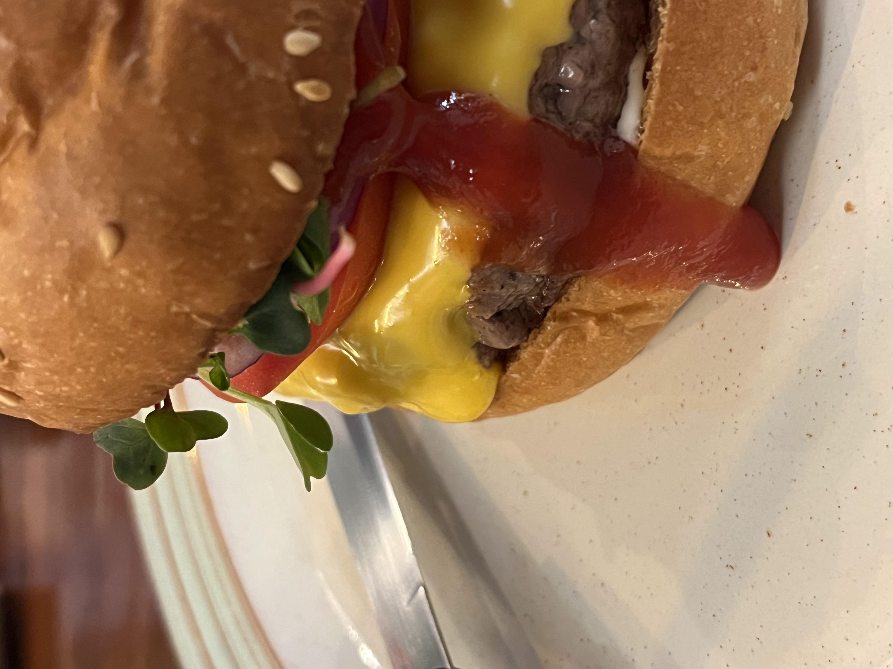

이 게시물은 **테스트 게시물**입니다.

# 텍스트

## 예시1

테스트 게시물입니다.  
테스트 게시물입니다.  
테스트 게시물입니다.

## 예시2

테스트 게시물입니다.  
~테스트 게시물입니다.~  
_테스트 게시물입니다._

## 예시3

### 인용문

> 인용문

### 목록

1. 첫번째 내용

   세부 사항

2. 두번째 내용
3. 세번째 내용

### 표

|  Table1  |  Table2  |
| :------: | :------: |
| Content1 | Content2 |

# 사진




# 링크

https://www.google.com/

[Google](https://www.google.com/)

# 코드

#### md

```md
예시 텍스트
```

---

#### 파이썬

```python
print("Hello World")
```

---

#### 루비

```ruby
require 'redcarpet'
markdown = Redcarpet.new("Hello World!")
puts markdown.to_html
```

---

#### C

```c
printf("Hello World");
```
